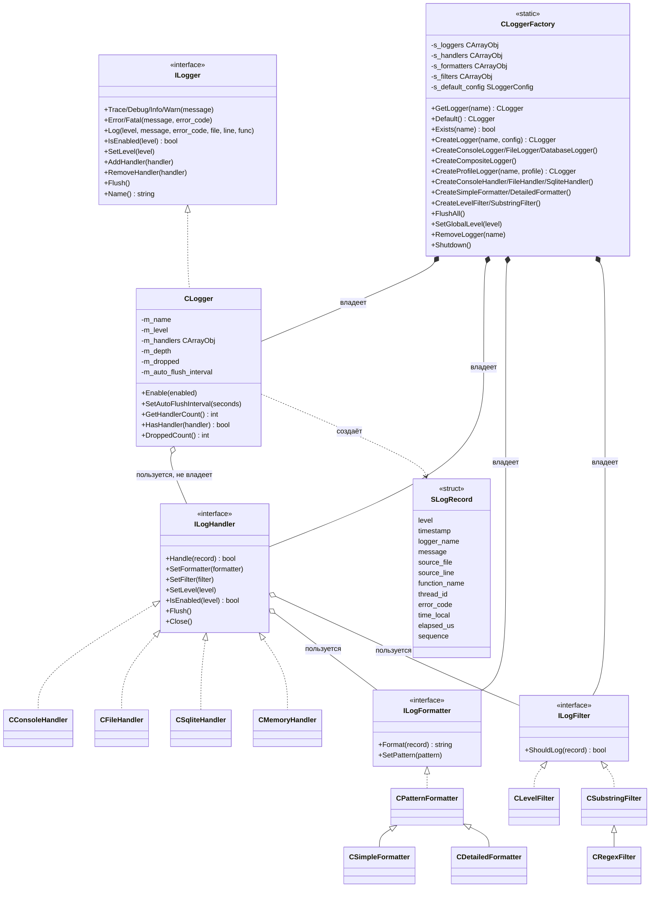
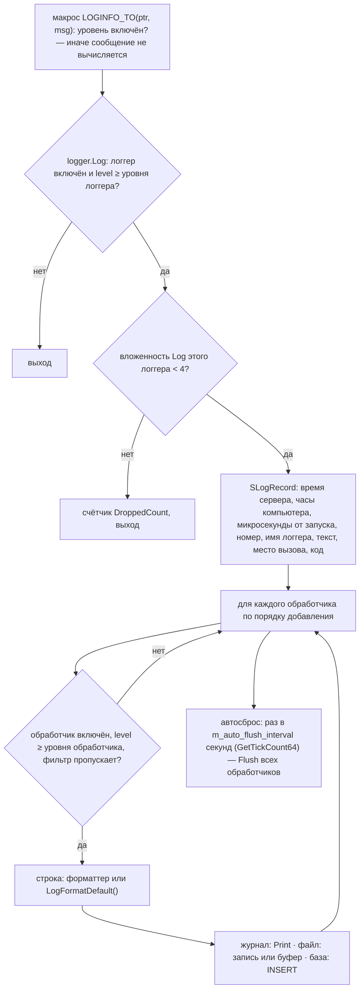

# Устройство библиотеки

Версия 2.0.0 (07.10.2026). Устройство версии 1.0.0 — этот же файл в коммите `eb9749a`. Подключение: `#include <Logger\Logger.mqh>` — один файл подключает всё.

## Части

| Каталог | Файлы | Что |
|---|---|---|
| `Core/` | `LogRecord.mqh` | уровни `ENUM_LOG_LEVEL` (`LOG_TRACE` 0 … `LOG_FATAL` 5), запись `SLogRecord` |
| | `Interfaces.mqh` | `ILogger`, `ILogHandler`, `ILogFormatter`, `ILogFilter` (все — от `CObject`) |
| | `Logger.mqh` | `CLogger` — уровень, список обработчиков, автосброс |
| | `Macros.mqh` | `LOGTRACE` … `LOGFATAL` (логгер `default`), `…_N` (по имени), `…_TO` (по указателю), `LOGERROR_CODE`, `LOGIF`, `LOGEXECUTION_TIME`, `LOGFUNCTION_ENTRY/EXIT`, `LOGTRADE_OPEN/CLOSE`; уровень проверяется до вычисления сообщения |
| `Handlers/` | `ConsoleHandler.mqh` | `Print` в журнал терминала, по желанию `Alert` для `ERROR` и `FATAL` |
| | `FileHandler.mqh` | текстовый файл в `MQL5\Files` (UTF-8): прямая запись или буфер 8 КБ, ротация по размеру с нумерованными архивами |
| | `SqliteHandler.mqh` | таблица в базе SQLite в `MQL5\Files`: запись сразу или пакетами (LOG-D-01) |
| | `MemoryHandler.mqh` | кольцевой буфер последних строк в памяти |
| `Tester/` | `TesterLog.mqh` | журналы проходов оптимизации: `LogTesterSend` (кадр из `OnTester`), `CTesterLogCollector` (приём в терминале, база); подключается отдельно |
| `Formatters/` | `PatternFormatter.mqh`, `SimpleFormatter.mqh`, `DetailedFormatter.mqh` | строка из записи по шаблону с полями `%имя%`: шаблон разбирается один раз, строка собирается за один проход |
| `Filters/` | `LevelFilter.mqh`, `SubstringFilter.mqh` (`RegexFilter.mqh` — устаревшее имя) | отбор записей по уровню и по вхождению подстроки |
| `Factory/` | `LoggerFactory.mqh` | `CLoggerFactory` — статические реестры, создание и настройка, профили |
| корень | `Logger.mqh` | подключения, `GetLogger()`, `FlushAllLoggers()`, `ShutdownLogging()` |

## Классы

## Путь записи

Макросы без имени берут логгер `CLoggerFactory::Default()` (указатель хранится в фабрике); его нет — он создаётся
с конфигурацией по умолчанию (журнал терминала, уровень `INFO`). Программа MQL5 однопоточная — блокировок нет.

## Уровни: три места отсечения

1. Логгер — `CLogger::SetLevel` (по умолчанию `INFO`).
2. Обработчик — `SetLevel` (по умолчанию `TRACE`, то есть всё).
3. Фильтр обработчика — `ILogFilter::ShouldLog`.

## Владение и срок жизни

- Всё, что создано методами фабрики, записано в её статические реестры (`CArrayObj`, освобождение включено) и
  удаляется в `Shutdown()` либо при завершении программы.
- `CLogger` хранит указатели на обработчики без владения и не закрывает их.
- Обработчик хранит указатели на форматтер и фильтр без владения.
- Объект, созданный `new` мимо фабрики, освобождает тот, кто создал.
- `RemoveLogger(name)` удаляет логгер и те его обработчики из реестра фабрики, которыми не пользуется другой
  логгер (деструктор обработчика закрывает файл или базу). Форматтеры и фильтры живут до `Shutdown()`.
- Логгер с существующим именем не пересоздаётся: `CreateLogger` возвращает прежний.

## Конфигурация

`SLoggerConfig`: имя, уровень, включён ли, вывод в журнал / файл / базу, имена файла и базы, шаблон, подробный
формат, прямая запись, интервал сброса. `CreateLogger(name, config)` по ней создаёт обработчики и форматтеры.

Профили `CreateProfileLogger(name, profile)` — уровень логгера равен наименьшему уровню обработчиков:

| Профиль | Журнал терминала | База `<имя>.db` |
|---|---|---|
| `LOGGER_PROFILE_DEBUG` | от `WARN` | от `TRACE`, запись сразу |
| `LOGGER_PROFILE_PERFORMANCE` | от `WARN` | нет |
| `LOGGER_PROFILE_PRODUCTION` | от `WARN` | от `INFO`, запись сразу |

## Файл

Имя — относительно `MQL5\Files` программы (в тестере — папка агента) или общей папки терминалов. Открытие —
`FILE_READ | FILE_WRITE | FILE_SHARE_READ | FILE_TXT | FILE_ANSI`, UTF-8 (без `FILE_READ` — в режиме перезаписи,
один раз). Буфер сбрасывается при 8 192 знаках, по интервалу (60 с по `GetTickCount64()`), в `Flush()` и при
закрытии. Ротация: при достижении размера файл переименовывается в `<имя>.<N><расширение>`, N — следующий
свободный. Сбой открытия — повтор раз в 5 с, счётчик несохранённых записей.

## База

Файл — относительно `MQL5\Files`. Таблица (имя по умолчанию `logs`):

| Столбец | Тип | Что |
|---|---|---|
| `id` | INTEGER PRIMARY KEY AUTOINCREMENT | |
| `ticktime` | DATETIME (текст `ГГГГ.ММ.ДД ЧЧ:ММ:СС`) | время сервера |
| `level` | INTEGER | 0…5 |
| `logger_name`, `message` | TEXT | |
| `source_file`, `source_line`, `function_name` | TEXT, INTEGER, TEXT | место вызова |
| `thread_id` | INTEGER | всегда 0 |
| `error_code` | INTEGER | |
| `timestamp` | INTEGER | время сервера, секунды |
| `created_at` | DATETIME DEFAULT CURRENT_TIMESTAMP | часы компьютера, UTC |
| `time_local` | INTEGER | часы компьютера, секунды |
| `elapsed_us` | INTEGER | микросекунды от запуска программы |
| `seq` | INTEGER | номер записи в программе |

Запись — `INSERT` текстом (не подготовленным запросом — см. LOG-D-01); по умолчанию каждая запись — своя
транзакция, `synchronous = NORMAL`; пакетный режим — явная транзакция, `COMMIT` каждые `batch_size` записей.
Индексы — по требованию.

## Как пользуются в `mql`

- Советник создаёт логгер профилем и передаёт указатель вниз: `ExtExpert.SetLogger(g_logger)` →
  `CExpertSeries` → сигнал, серии, фильтры (`SetLogger` у каждого класса).
- Классы хранят `ILogger *m_logger` и пишут `m_logger.Log(LOG_X, StringFormat(...), 0, __FILE__, __LINE__,
  __FUNCTION__)` — 376 мест; перевод на `LOG…_TO` — LOG-BL-12.
- В `OnDeinit` советника — `FlushAllLoggers()` и `ShutdownLogging()`.
