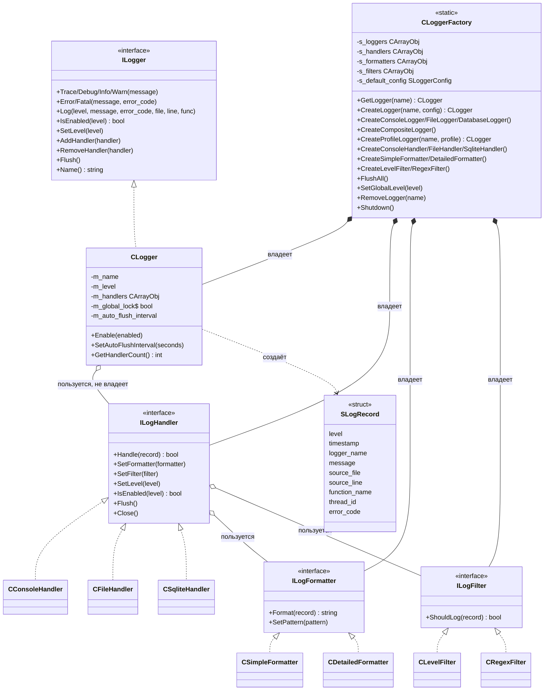
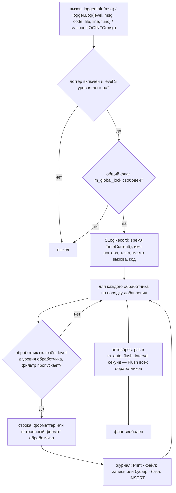

# Устройство библиотеки (как есть)

Коммит `9a3c318`, версия 1.0.0. Подключение: `#include <Logger\Logger.mqh>` — один файл подключает всё.

## Части

| Каталог | Файлы | Что |
|---|---|---|
| `Core/` | `LogRecord.mqh` | уровни `ENUM_LOG_LEVEL` (`LOG_TRACE` 0 … `LOG_FATAL` 5), запись `SLogRecord` |
| | `Interfaces.mqh` | `ILogger`, `ILogHandler`, `ILogFormatter`, `ILogFilter` (все — от `CObject`) |
| | `Logger.mqh` | `CLogger` — уровень, список обработчиков, автосброс |
| | `Macros.mqh` | `LOGTRACE` … `LOGFATAL`, `…_N` (по имени логгера), `LOGERROR_CODE`, `LOGIF`, `LOGEXECUTION_TIME`, `LOGFUNCTION_ENTRY/EXIT`, `LOGTRADE_OPEN/CLOSE` |
| `Handlers/` | `ConsoleHandler.mqh` | `Print` в журнал терминала, по желанию `Alert` для `ERROR` и `FATAL` |
| | `FileHandler.mqh` | текстовый файл в `MQL5\Files`: прямая запись или буфер 8 КБ, ротация по размеру |
| | `SqliteHandler.mqh` | таблица в базе SQLite в `MQL5\Files`: автокоммит или пакеты |
| `Formatters/` | `SimpleFormatter.mqh`, `DetailedFormatter.mqh` | строка из записи по шаблону с полями `%имя%` |
| `Filters/` | `LevelFilter.mqh`, `RegexFilter.mqh` | отбор записей по уровню и по вхождению подстроки |
| `Factory/` | `LoggerFactory.mqh` | `CLoggerFactory` — статические реестры, создание и настройка, профили |
| корень | `Logger.mqh` | подключения, `GetLogger()`, `FlushAllLoggers()`, `ShutdownLogging()` |

## Классы

## Путь записи

Макросы без имени берут логгер `CLoggerFactory::GetLogger("default")`; его нет — он создаётся с конфигурацией по
умолчанию (журнал терминала, уровень `INFO`).

## Уровни: три места отсечения

1. Логгер — `CLogger::SetLevel` (по умолчанию `INFO`).
2. Обработчик — `SetLevel` (по умолчанию `TRACE`, то есть всё).
3. Фильтр обработчика — `ILogFilter::ShouldLog`.

## Владение и срок жизни

- Всё, что создано методами фабрики, записано в её статические реестры (`CArrayObj`, освобождение включено) и
  удаляется в `Shutdown()` либо при завершении программы.
- `CLogger` хранит указатели на обработчики без владения; в деструкторе вызывает их `Close()`.
- Обработчик хранит указатели на форматтер и фильтр без владения.
- Объект, созданный `new` мимо фабрики, освобождает тот, кто создал.
- `RemoveLogger(name)` удаляет логгер; его обработчики остаются в реестре фабрики.

## Конфигурация

`SLoggerConfig`: имя, уровень, включён ли, вывод в журнал / файл / базу, имена файла и базы, шаблон, подробный
формат, прямая запись, интервал сброса. `CreateLogger(name, config)` по ней создаёт обработчики и форматтеры.

Профили `CreateProfileLogger(name, profile)` — уровень логгера `TRACE`, далее:

| Профиль | Журнал терминала | База `<имя>.db` |
|---|---|---|
| `LOGGER_PROFILE_DEBUG` | от `WARN` | от `TRACE`, автокоммит |
| `LOGGER_PROFILE_PERFORMANCE` | от `WARN` | нет |
| `LOGGER_PROFILE_PRODUCTION` | от `WARN` | от `INFO`, автокоммит |

## Файл

Имя — относительно `MQL5\Files` программы (в тестере — папка агента). Открытие — `FILE_WRITE | FILE_TXT`
(+ `FILE_REWRITE` без дозаписи); кодировка — UTF-16 с BOM. Буфер сбрасывается при 8 192 знаках, по интервалу
(60 с по `TimeCurrent()`), в `Flush()` и при закрытии. Ротация: при достижении размера файл переименовывается в
`<имя>_<ГГГГ.ММ.ДД><расширение>`.

## База

Файл — относительно `MQL5\Files`. Таблица (имя по умолчанию `logs`):

| Столбец | Тип | Что |
|---|---|---|
| `id` | INTEGER PRIMARY KEY AUTOINCREMENT | |
| `ticktime` | DATETIME (текст `ГГГГ.ММ.ДД ЧЧ:ММ:СС`) | время записи |
| `level` | INTEGER | 0…5 |
| `logger_name`, `message` | TEXT | |
| `source_file`, `source_line`, `function_name` | TEXT, INTEGER, TEXT | место вызова |
| `thread_id` | INTEGER | всегда 0 |
| `error_code` | INTEGER | |
| `timestamp` | INTEGER | время записи, секунды |
| `created_at` | DATETIME DEFAULT CURRENT_TIMESTAMP | часы компьютера, UTC |

Индексы: `timestamp`, `level`, `logger_name`, `created_at`. Запись — `INSERT` текстом на каждую запись; в
автокоммите — сразу, иначе — транзакция, `COMMIT` каждые `batch_size` записей.

## Как пользуются в `mql`

- Советник создаёт логгер профилем и передаёт указатель вниз: `ExtExpert.SetLogger(g_logger)` →
  `CExpertSeries` → сигнал, серии, фильтры (`SetLogger` у каждого класса).
- Классы хранят `ILogger *m_logger` и пишут
  `if(m_logger != NULL) m_logger.Log(LOG_X, StringFormat(...), 0, __FILE__, __LINE__, __FUNCTION__)` — 376 мест.
- В `OnDeinit` советника — `FlushAllLoggers()` и `ShutdownLogging()`.
- Макросами `LOG…` потребители не пользуются.
